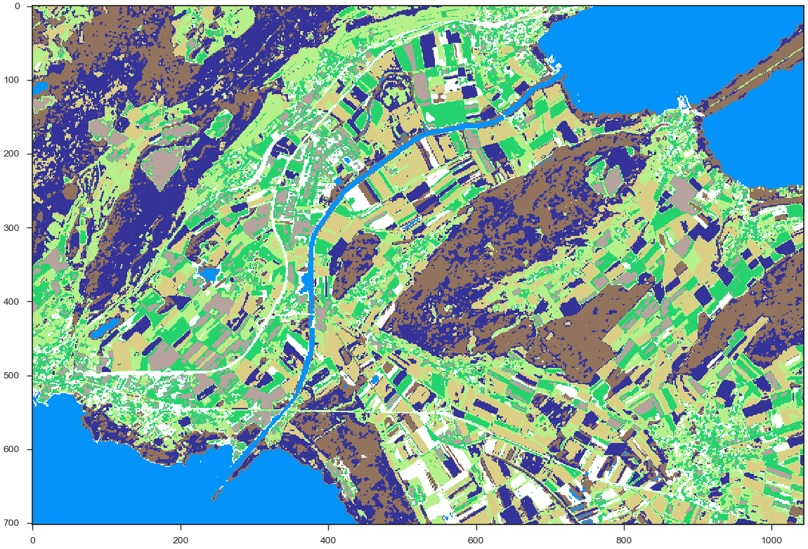
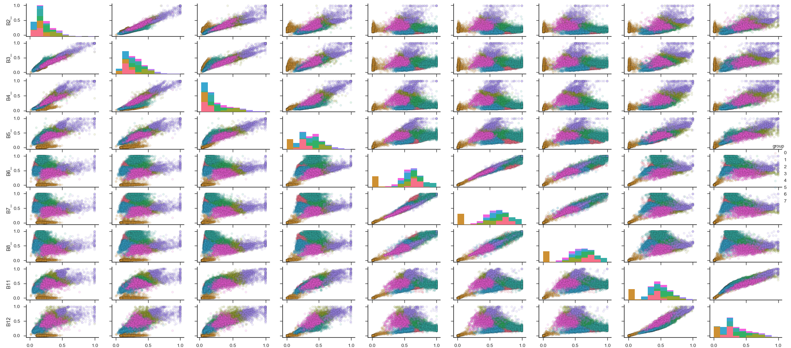

# LandSurfaceClustering

Landon Halloran  /  www.ljsh.ca  /  03.2019

This is a script that reads in remote sensing data, performs k-means clustering on sample pixels from the images, and then plots the result. As this is an unsupervised learning algorithm, some knowledge of the "ground truth" will be needed in order to interpret results.
The script will be made more general in the future... for now, you will need to edit it manually.

# Example data
9 bands of Sentinel-2 data in 8-bit png format, some bands resampled to 10m resolution.

# Example output:

